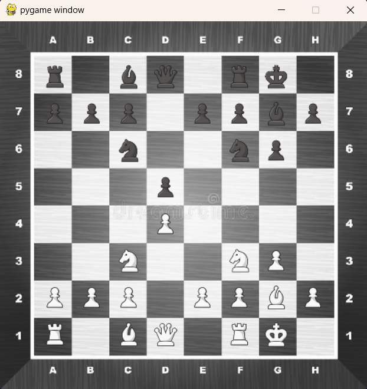

# Chess Game

## Overview

This is a simple yet engaging chess game implemented in Python using the Pygame library. The project is a result of my passion for both chess and programming, and it demonstrates my skills in game development and logic implementation.

## Features

- **Classic Chess Rules:** The game follows the standard rules of chess, allowing players to enjoy the authentic experience.

- **Graphical Interface:** The graphical user interface is built using Pygame, providing an interactive and visually appealing chessboard.

- **Player vs Player:** Play against a friend locally, taking turns to make moves on the chessboard.

- **Move Validation:** The game ensures that players adhere to the legal moves defined by the rules of chess.

- **Check and Checkmate Detection:** The program identifies check and checkmate situations, enhancing the gaming experience.

## Requirements

- Python 3.x
- Pygame library (install using `pip install pygame`)

## How to Run

1. Clone the repository to your local machine.
2. Ensure you have Python and Pygame installed.
3. Navigate to the project directory in your terminal.
4. Run the `main.py` file with Python: `python main.py`.

```
curl https://bootstrap.pypa.io/get-pip.py -o get-pip.py
python get-pip.py
pip install -r requirements.txt
python main.py
```

## Controls

- Use the mouse to select and move pieces on the chessboard.

## Screenshots



## Demo Video

[Link to Demo Video](https://www.youtube.com/shorts/tNB5TMJMdQI)

## Future Enhancements

- Implement an AI opponent for single-player mode.
- Add support for additional chess variants.
- Improve the graphical interface with animations and sound effects.

## Contributions

Contributions are welcome! If you find any bugs or have suggestions for improvements, please open an issue or submit a pull request.

## License

This project is licensed under the [MIT License](LICENSE).

## Acknowledgments

- Special thanks to the Pygame community for providing an excellent library for game development.
- Chess piece icons by [Chess.com](https://www.chess.com/).


How it was done
# CHESS
We are going to make a Chess game that two players could potentially play
Things the Game should have
## 1. A board
    1. A picture of a board that I can calculate the pixels and then divide into 64 squares +
    
         _________________________________________
      8 +  0,0; 0,1; 0,2; 0,3; 0,4; 0,5; 0,6; 0,7 |
      7 +  1,0; 1,1; 1,2; 1,3; 1,4; 1,5; 1,6; 1,7 |
      6 +  2,0; 2,1; 2,2; 2,3; 2,4; 2,5; 2,6; 2,7 |
      5 +  3,0; 3,1; 3,2; 3,3; 3,4; 3,5; 3,6; 3,7 |
      4 +  4,0; 4,1; 4,2; 4,3; 4,4; 4,5; 4,6; 4,7 |
      3 +  5,0; 5,1; 5,2; 5,3; 5,4; 5,5; 5,6; 5,7 |
      2 +  6,0; 6,1; 6,2; 6,3; 6,4; 6,5; 6,6; 6,7 |
      1 +  7,0; 7,1; 7,2; 7,3; 7,4; 7,5; 7,6; 7,7 |
        +  +++++++++++++++++++++++++++++++++++++++|
            A    B    C    D    E    F    G    H 

## 2. Pieces
    1. Each piece should have a set of moves that they can do 
    2. and only those moves can be played. When piece is pressed
    3. it will show the possible squares that piece can reach
    4. 2.1 Pons
    5. 2.2 Knights
    6. 2.3 Bishops
    7. 2.4 Queen
    8. 2.5 King

## 3. Game Starts
    1. State start = 0 // white is even // black is odd
    2. Logic to tell if odd or even to determine who's turn it is. 
    3. Each player should have 2 clicks that will be calculated
        1. White(For Example) First Click: 
            1. See what is on the square that was presssed first (Black or White Owner)
            2. If Black: 
                1. tell it to pick a white piecel don't add square pressed to list
            3. If None: 
                1. tell it to picka  white piece; don't add square pressed to list
            4. If White: 
                1. Call the moves function with the corresponding piece that was pressed and see what squares are legal
                2. Color all of those squares in the list an opaque green
        2. White: Second Click:
            1. See if the square that was clicked second is in our list of legal moves that we created with First Click
            2. If not:
                1. Don't select that move to be put into our list. 
                2. Do not register that that move has been played. 
                3. Allow player to retry the second move
            3. If so:
                1. add that second square to the list of moves made 
                2. remove what was on the square for First Click and add the piece that was on the square square from First Click to square for Second Click
                3. start = start + 1
        3. Black: First Click:
            1. See what is on the square that was presssed first (Black or White Owner)
            2. If White: 
                1. tell it to pick a white piecel don't add square pressed to list
            3. If None: 
                1. tell it to picka  white piece; don't add square pressed to list
            4. If Black: 
                1. Call the moves function with the corresponding piece that was pressed and see what squares are legal
                2. Color all of those squares in the list an opaque green
        4. Black: Second Click: 
            1. See if the square that was clicked second is in our list of legal moves that we created with First Click
            2. If not:
                1. Don't select that move to be put into our list. 
                2. Do not register that that move has been played. 
                3. Allow player to retry the second move
            3. If so:
                1. add that second square to the list of moves made 
                2. remove what was on the square for First Click and add the piece that was on the square square from First Click to square for Second Click
                3. start = start + 1


